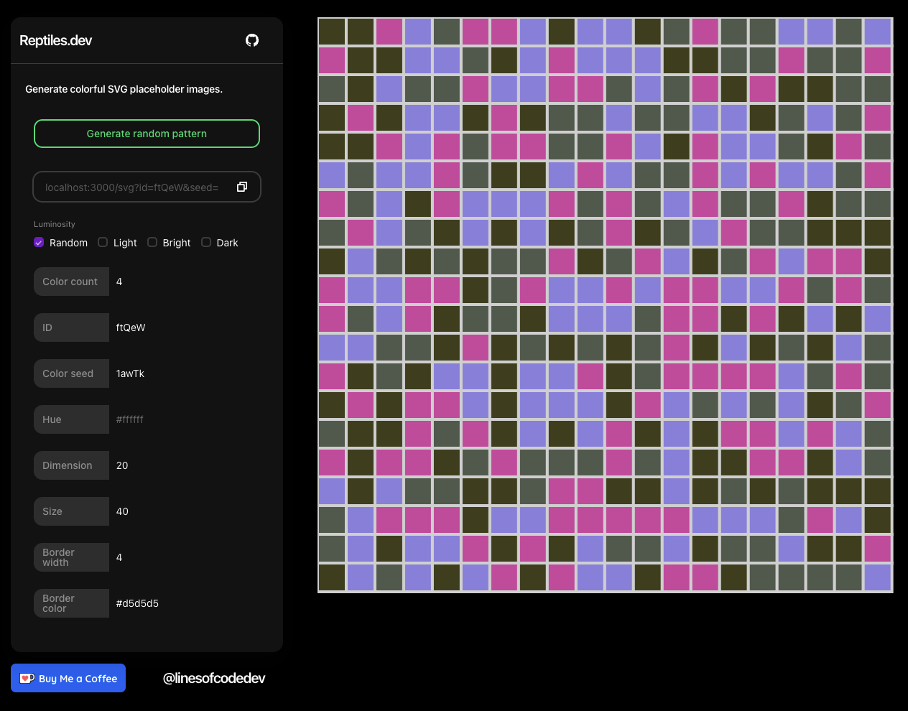

# reptiles.dev

Generate colorful and temporarily identifiable SVGs with unique urls.

🦎
 [Website](https://reptiles.dev) · 🔗 [Quick Link](https://reptiles.dev/svg) · 🛝 [GraphQL Playground](https://reptiles.dev/graphql)



## Usage

Simply generate an image by using the [/svg](https://reptiles.dev/svg) endpoint to generate a single SVG, providing any optional query parameters. Include a key in an url like [/svg?key=123](https://reptiles.dev/svg) to generate a unique but temporary image cached with this key for a short time.

You also can visit [reptiles.dev](https://reptiles.dev) to generate placeholder images using a UI and create shareable urls.

Alternatively visit the [GraphQL playground](https://reptiles.dev/graphql) and read the detailed documentation on all available options.

## How it works

Every image is given a key and cached for a short while. Including the key of the image in a link will return the cached image. If no image is cached than one will be generated cached with the given key.

This method of generating random yet temporarily identifiable image is great to use when mocking & developing front-ends, mapping some data to ids, or as placeholder images inside a
Storybook.

## Examples

```html


```


